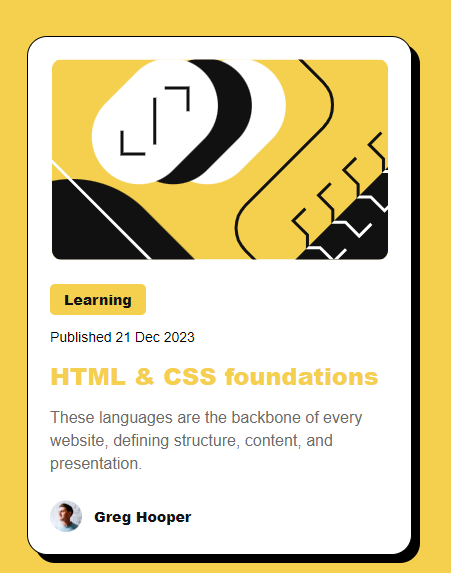

# Frontend Mentor - Blog preview card

## Olá! 👋

Essa é a resolução de um desafio proposto pelo site <a href="https://www.frontendmentor.io/home" target="_blank">Frontend Mentor</a>, com o objetivo de testar minhas habilidades em desenvolvimento front-end. Pretendo compartilhar uma série de desafios à medida que avanço. Esse é o meu segundo projeto.

## Sobre o Frontend Mentor:

O Frontend Mentor é uma plataforma que oferece desafios de desenvolvimento front-end para ajudar programadores a aprimorar suas habilidades. A plataforma é voltada tanto para iniciantes quanto para desenvolvedores experientes. O site disponibiliza projetos práticos de diversos níveis de dificuldade, permitindo que os usuários pratiquem a construção de layouts responsivos, implementem funcionalidades interativas e aperfeiçoem suas habilidades em HTML, CSS e JavaScript. 
Os desafios geralmente incluem um design de interface pré-definido (em formatos como Figma ou imagens), e cabe ao desenvolvedor escrever o código para trazer esse design à vida. Além disso, os participantes podem compartilhar suas soluções e receber feedback da comunidade, tornando o processo de aprendizado mais colaborativo. 
É uma excelente forma de desenvolver habilidades práticas e construir um portfólio, especialmente para aqueles que buscam experiência real em desenvolvimento front-end.

## Sobre o desafio

O desafio consiste em criar um card para a visualização de um blog. Assim como no desafio anterior, o card conta com uma centralização vertical e horizontal, além de posicionamentos de imagens e textos. O site Frontend Mentor disponibiliza todo o material utilizado no projeto, incluindo alguns arquivos de fotos com o layout sugerido.
Aqui está a prévia do layout final do desafio:

  

## Solução

Na resolução deste desafio, utilizei HTML5 e CSS. Para estilizar o projeto, usei display: flex, que é justamente o que estou aprendendo atualmente.
Diferentemente do projeto anterior, que pode ser visto <a href="https://ederprocopio.github.io/frontend-mentor-qr-code-component/" target="_blank" >aqui</a>, neste card utilizei uma variedade maior de declarações em flex.
O desafio pedia um link que mudasse de cor ao passar o mouse, mas tomei a liberdade de acrescentar outros links, pois julguei que ficaria mais padronizado com o que é utilizado em um projeto real.
Fiz o upload da minha versão do projeto para o GitHub Pages, que pode ser visto no link abaixo:

  
